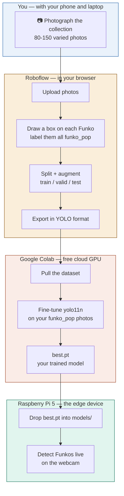
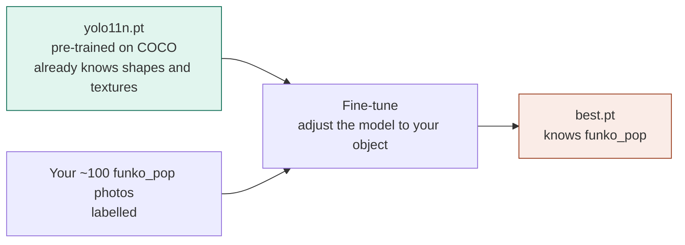
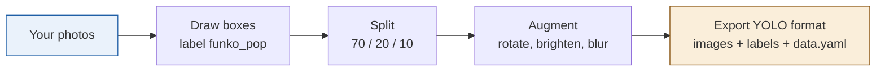
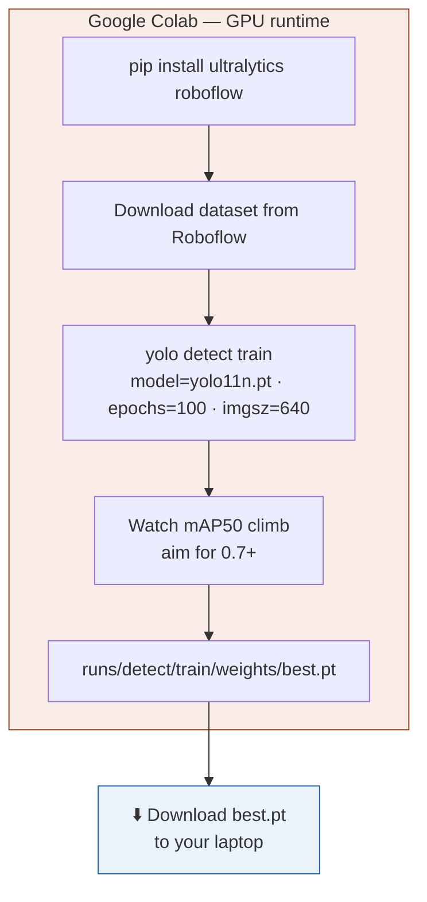

# 🎯 Funko Pop Detector — Custom Model Training Manual

**A step-by-step manual for teaching the Raspberry Pi object detector to recognise a brand-new object it has never seen: a Funko Pop.**

This folder is the **custom-object phase** (Phase 5) of the parent [Raspberry Pi Object Detector](../README.md) project. The base detector already knows ~80 everyday objects (person, cup, chair…) from the COCO dataset — but it has no idea what a "Funko Pop" is. Here we *teach* it one, using photos of a real collection.

> **This document is written as a manual anyone can follow.** Every step explains **what** we do, **why** we do it, the exact **commands**, and the **tools** and **links** involved. If you've never trained a model before, you can follow this top to bottom.

---

## What we're building (and the one big decision)

We're training a **single-class detector**: the model learns one new label, **`funko_pop`**, and draws a box around any Funko Pop it sees — regardless of which character it is.

**Why single-class for v1?** Two honest reasons:
- **It proves the whole pipeline works** (collect → label → train → deploy) with the least effort. That's the milestone.
- **Detecting individual characters** ("batman", "stitch"…) is far more labelling work — it needs ~40–60 photos *per character*. That's a great **v2**, but v1 should ship first. This mirrors the parent project's rule: *"working and honest beats ambitious and unfinished."*

| Decision | Choice | Why |
|---|---|---|
| **Classes** | 1 — `funko_pop` | Fastest path to a working v1; one label to draw. |
| **Dataset size** | ~80–150 photos of a 10–30 piece collection | Enough variety for a robust single-class model. |
| **Base model** | `yolo11n.pt` (nano) | Same model the Pi already runs; smallest/fastest for edge. |
| **Where we train** | Google Colab (free GPU) | Training is heavy — minutes on a cloud GPU vs. days on the Pi. |
| **Where it runs** | On the Pi (CPU) | The core edge-AI idea: train in the cloud once, run on-device forever. |

---

## The big picture

The whole journey, end to end. The **solid path** is a one-time training pipeline; the output (`best.pt`) drops into the Pi exactly where the old model sat.



**Reading it:** you create the raw material (photos), Roboflow turns it into a labelled dataset, Colab turns that into a trained model, and the Pi runs it. Only the last box happens on the device.

---

## The idea underneath: transfer learning

We are **not** training a model from zero — that would need millions of images. Instead we take `yolo11n`, which has *already* learned from millions of photos what edges, shapes, and textures look like, and we only teach it the **last part**: "this particular shape is a `funko_pop`." That's **transfer learning**, and it's why ~100 photos is enough instead of ~100,000.



---

## Step 1 — Collect the images 📷

**Goal:** 80–150 photos of your collection. With 10–30 Funkos, that's a handful of shots of each.

**Tool:** your phone camera. Nothing fancy.

**The golden rule is variety.** The model only becomes robust if the photos look *different* from each other. Deliberately vary:

- **Angle** — front, 3/4, side, slightly above/below.
- **Distance** — close-ups and further-back shots.
- **Lighting** — daylight, lamp light, some shadow.
- **Background** — shelf, desk, plain wall, cluttered scene. Cluttered is *good* — it teaches the model to separate the Funko from noise.
- **Grouping** — some photos with one Funko, some with several in frame.
- **Partial views** — a Funko half behind another, or partly out of frame.

> 💡 **Why variety beats quantity.** 100 near-identical photos teach the model almost nothing new. 80 genuinely different ones teach it a lot. If it only ever sees Funkos centred on a white desk, it will fail the moment one sits on a shelf.

**Optional but powerful — "negatives":** a few photos of your shelves/desk with *no* Funko at all. These teach the model what is *not* a Funko and cut false positives.

**Transfer them** to your laptop (AirDrop, Google Photos, USB) — you'll upload them to Roboflow in the next step, from the laptop browser.

---

## Step 2 — Label the images in Roboflow 🏷️

**Tool:** [Roboflow](https://roboflow.com) — a free, browser-based tool for drawing boxes on images and exporting them in the format YOLO expects. No install.

**Why Roboflow:** drawing bounding boxes by hand is fiddly; Roboflow makes it fast, handles the train/validation/test split, adds augmentations, and exports a ready-to-train dataset with one click.

1. **Create a free account** at [roboflow.com](https://roboflow.com) and click **Create New Project**.
   - Project type: **Object Detection**
   - Annotation group / class name: **`funko_pop`**
2. **Upload** all your photos (drag them in).
3. **Annotate:** open each image and draw a tight box around every Funko Pop, labelling each `funko_pop`. Tight boxes = better training.
   - 💡 Roboflow's **"Label Assist" / Auto-Label** can pre-draw boxes for you to just correct — a big time saver once you've labelled a few by hand.
4. **Split the dataset** when prompted — a **70% train / 20% valid / 10% test** split is the standard. *Why:* the model learns on **train**, is checked on **valid** during training (data it didn't learn from), and is honestly graded on **test** at the end.
5. **Add augmentations** (Generate step) to stretch your dataset further — the model sees each photo in several altered forms:
   - Rotation (±15°), brightness (±25%), slight blur, maybe horizontal flip.
   - *Why:* free extra variety — a Funko is still a Funko when rotated or dimmer. This is how ~100 photos becomes ~300 training examples.
6. **Generate the version**, then **Export** → choose format **YOLOv11** (or "YOLO PyTorch TXT"). Pick **"show download code"** — Roboflow gives you a short Python snippet with an API key. **Copy it**; you'll paste it into Colab in Step 3.



**What you end up with:** a dataset folder of images, a matching `.txt` label file per image (each line = one box: `class x y w h`), and a **`data.yaml`** that tells YOLO where the train/valid/test images are and the class names. That `data.yaml` is the single file training points at.

---

## Step 3 — Train the model on Google Colab 🧠

**Tool:** [Google Colab](https://colab.research.google.com) — free notebooks with a cloud **GPU**. We train here, not on the Pi, because training does far more math than detection and the Pi would take days.

1. **New notebook** at [colab.research.google.com](https://colab.research.google.com).
2. **Turn on the GPU:** menu **Runtime → Change runtime type → Hardware accelerator → GPU (T4)**. *Why:* GPUs do the parallel math of training ~50× faster than a CPU.
3. **Install YOLO** in the first cell:
   ```python
   !pip install ultralytics roboflow
   ```
4. **Pull your dataset** — paste the snippet Roboflow gave you in Step 2. It looks roughly like:
   ```python
   from roboflow import Roboflow
   rf = Roboflow(api_key="YOUR_KEY")
   project = rf.workspace("your-workspace").project("funko_pop")
   dataset = project.version(1).download("yolov11")
   ```
   This downloads the images, labels, and `data.yaml` into the Colab machine.
5. **Train:**
   ```python
   !yolo detect train model=yolo11n.pt data={dataset.location}/data.yaml epochs=100 imgsz=640
   ```
   What each part means:
   - `model=yolo11n.pt` — start from the pre-trained nano model (transfer learning).
   - `data=…/data.yaml` — your dataset (from step 4).
   - `epochs=100` — how many times the model sees the whole dataset. More = better, up to a point (then it "overfits" — memorises instead of generalises). 100 is a good start for a small set.
   - `imgsz=640` — training image size, matching what the Pi runs.
6. **Watch the numbers.** As it trains, YOLO prints metrics per epoch. The one to watch is **mAP50** (mean Average Precision) — a 0–1 score of detection quality. It should climb and plateau. **0.7+ is a solid v1** for one object.
7. **Get your model.** Training saves everything to `runs/detect/train/`. Your trained weights are:
   ```
   runs/detect/train/weights/best.pt
   ```
   `best.pt` = the checkpoint from the epoch with the best validation score (as opposed to `last.pt`, the final one). **Download `best.pt`** from Colab's file browser (or save to Google Drive).



> ⚠️ **Colab disconnects when idle** and wipes the machine. Download `best.pt` (or save it to Drive) as soon as training finishes — don't leave it sitting in a Colab that will vanish.

---

## Step 4 — Deploy to the Raspberry Pi 🥧

Now bring the trained model home to the device.

1. **Copy `best.pt` onto the Pi**, into the `models/` folder of the parent project. From your laptop:
   ```bash
   scp best.pt oleg@mypi.local:~/cv-project/models/best.pt
   ```
   *(Or drag it into the `models/` folder in the VS Code Remote-SSH file explorer.)*
2. **Test on a still image first** (no camera needed) — point a photo of a Funko at it:
   ```bash
   cd ~/cv-project && source venv/bin/activate
   yolo predict model=models/best.pt source=some_funko_photo.jpg
   ```
   Open the annotated result in `runs/detect/predict/` — you should see a `funko_pop` box.
3. **Run it live.** The existing detection scripts take a model path — point one at `best.pt` instead of `yolo11n.pt`. That single change is the whole deployment:
   ```python
   model = YOLO("models/best.pt")   # your Funko model instead of the stock one
   ```
4. *(Later, optional)* wire a **`/funko` Telegram command** into `telegram_control.py`, exactly like `/people`, so you can start Funko-detection from your phone.

**The key point:** nothing else in the pipeline changes. The camera, the alerting, the cooldown, the web stream — all of it works identically. We only swapped the *brain*.

---

## Step 5 — Evaluate and iterate 🔁

The first model is rarely the final one. Point it at your real collection and be honest about what it gets wrong:

- **Misses Funkos** in certain poses/lighting → collect more photos of *those* conditions and retrain.
- **False positives** (calls a mug a Funko) → add more negatives and varied backgrounds.
- **Only works close up** → add more distant shots.

Each round: add the photos that cover the failure, regenerate the dataset in Roboflow, retrain in Colab, redeploy. Small honest improvements compound.

> **Don't chase perfection for v1.** ~80% accuracy on one object from ~100 phone photos is a completely legitimate, ship-worthy result. Ship it, then improve.

---

## Step 6 — Document and publish 📣

- **Record a demo** of it detecting Funkos live (screen recording of the web stream is highest-impact) → `../docs/demo.gif`.
- **Describe the dataset** (how many photos, how varied, accuracy reached) in `../data/README.md` — *describe it, don't commit the raw images.*
- **Fill in the parent README's** "What I learned / tradeoffs" section with the real numbers: photos used, mAP reached, what confused the model.

---

## Tools & terms glossary

| Term / tool | Plain-English meaning |
|---|---|
| **Bounding box** | The rectangle you draw around an object to say "it's here." |
| **Class / label** | The name of what's in the box. We use one: `funko_pop`. |
| **Roboflow** | Browser tool to draw boxes and export a YOLO-ready dataset. |
| **Google Colab** | Free cloud notebook with a GPU — where training runs. |
| **Transfer learning** | Starting from a model that already knows shapes, and teaching it one new object — needs far less data. |
| **Epoch** | One full pass of the model over the whole training set. |
| **Augmentation** | Auto-altered copies of your photos (rotated, dimmer…) for free extra variety. |
| **Overfitting** | When a model memorises the training photos instead of learning the general object — it aces training but fails on new photos. |
| **mAP50** | Mean Average Precision — the 0–1 score of detection quality. Aim 0.7+. |
| **`data.yaml`** | The file that tells YOLO where the images are and the class names. |
| **`best.pt`** | Your trained model file — the deliverable that goes on the Pi. |

---

## Links & references

- **Roboflow** — [roboflow.com](https://roboflow.com) · [Getting started docs](https://docs.roboflow.com)
- **Google Colab** — [colab.research.google.com](https://colab.research.google.com)
- **Ultralytics YOLO training docs** — [docs.ultralytics.com/modes/train](https://docs.ultralytics.com/modes/train/)
- **Ultralytics: train a custom model** — [docs.ultralytics.com/guides](https://docs.ultralytics.com/)
- **Parent project** — [../README.md](../README.md) · design rationale in [../DESIGN.md](../DESIGN.md)

---

*Progress against these steps is tracked in [progress.md](./progress.md) (local working notes). This README is the public manual — keep it accurate as the build evolves.*
