# The Detection Pipeline — Lens to Phone

> How a single frame travels from the camera lens to a Telegram alert on your phone — every step, the tool it uses, and *why* that step exists. A companion to the [`README.md`](./README.md) (how to build it) and [`DESIGN.md`](./DESIGN.md) (why the stack was chosen).

---

## The one idea that makes it all click

**To a computer, an image is just a giant grid of numbers.** A 640×480 frame is roughly 920,000 values, one per pixel. Everything below is really about *creating, moving, or crunching that grid of numbers* — capturing it, reshaping it, running AI math over it, drawing on it, and sending it out.

---

## The pipeline

```mermaid
flowchart TD
    LENS["📷 Camera lens — Logitech C270<br/><b>WHY:</b> the eye — turns light into a raw digital frame"]

    subgraph pi["On the Raspberry Pi 5 — edge"]
        CAP["1 · Grab the frame<br/><b>USES:</b> OpenCV, via /dev/video0<br/><b>WHY:</b> pulls each frame off the webcam into the program"]
        ARR["2 · Frame becomes numbers<br/><b>USES:</b> NumPy array<br/><b>WHY:</b> an image is just a grid of numbers the rest can crunch"]
        PREP["3 · Resize and format<br/><b>USES:</b> OpenCV<br/><b>WHY:</b> YOLO expects a fixed 640px input, not the raw camera size"]
        INFER["4 · Detect objects<br/><b>USES:</b> YOLO running on PyTorch, CPU<br/><b>WHY:</b> the brain — finds what is in the frame and where"]
        CONF["5 · Confidence filter<br/><b>USES:</b> threshold set to 0.7<br/><b>WHY:</b> drop weak guesses so false alarms don't get through"]
        COOL["6 · Cooldown gate<br/><b>USES:</b> one timestamp per object, 60s window<br/><b>WHY:</b> at ~3-4 FPS, stops 200+ alerts a minute for one object"]
        DRAW["7 · Annotate and save<br/><b>USES:</b> YOLO's save, OpenCV underneath<br/><b>WHY:</b> draws the boxes and writes the alert image to send"]
        SEND["8 · Send the alert<br/><b>USES:</b> the requests library<br/><b>WHY:</b> pushes the photo out over HTTPS"]
    end

    subgraph off["Off-device"]
        TG["Telegram Bot API — sendPhoto<br/><b>WHY:</b> Telegram's servers relay the message to you"]
        PHONE["📲 Your phone<br/><b>WHY:</b> the annotated photo alert arrives"]
    end

    LENS --> CAP --> ARR --> PREP --> INFER --> CONF --> COOL --> DRAW --> SEND --> TG --> PHONE

    style pi fill:#E1F5EE,stroke:#0F6E56
    style off fill:#FAECE7,stroke:#993C1D
```

## How to read it in one pass

- **Steps 1–3 — get the picture in (OpenCV + NumPy).** Eyes and prep work: pull the frame off the camera and reshape it into what the model expects.
- **Step 4 — the thinking (YOLO on PyTorch).** The only true "AI" step. Everything before it feeds the model; everything after it acts on the model's answer.
- **Steps 5–6 — the product decisions (no library).** These are not a tool — they are choices about how the device should *behave*. The confidence filter kills false alarms; the cooldown stops spam. This is the difference between a demo and something usable.
- **Steps 7–8 — draw and ship (OpenCV + requests).** Mark up the frame and push it out.
- **Off-device.** Telegram's servers do the final hop to your phone — the *only* part that ever leaves the device. The video itself never does, which is the privacy argument for edge AI.

---

## The tools under the hood

Nothing here was installed by hand — `pip install ultralytics` pulled all of it in automatically, because YOLO can't run without them.

| Tool | Its job | Plain-English analogy |
|---|---|---|
| **OpenCV** | Capture frames from the webcam, resize them, draw boxes, save the annotated image | The **camera + darkroom** — gets the shot, then develops and marks it up |
| **NumPy** | Hold and do fast math on the grid of numbers that *is* the image | The **shared language of numbers** every other tool speaks |
| **PyTorch** | Run the millions of math operations inside the neural network | The **electricity and muscles** that make the brain actually run |
| **YOLO (Ultralytics)** | The object-detection model — decides what is in the frame and where | The **brain** doing the recognizing |
| **requests** | Send the finished photo to Telegram over HTTPS | The **mail carrier** |
| **Telegram Bot API** | Relay the message from the Pi to your phone | The **post office** |

**One sentence to remember it:** OpenCV gets the picture and draws on it, PyTorch does the thinking, and NumPy is the number-language they both speak — that trio is the backbone of nearly every computer-vision project, not just this one.
