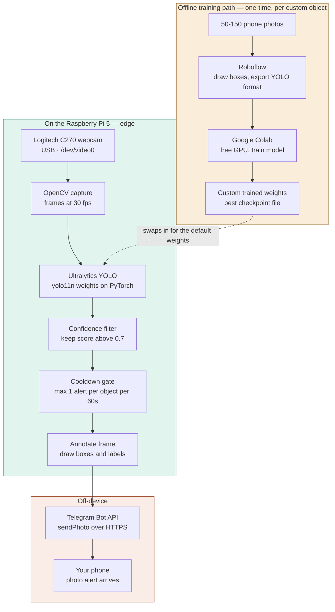

# 🥧 Raspberry Pi Object Detector

**A real-time AI object detector that runs on a Raspberry Pi 5 — built from scratch by someone learning hands-on, and written so a complete beginner can rebuild it.**

This device watches a camera feed and draws live labeled boxes around objects it recognizes ("person", "cup", "laptop"…), then is customized to detect one object of my own choosing. All the AI runs **on the device itself** ("edge AI") — no cloud, no internet round-trips — the same idea behind smart cameras like Ring and Nest.

> _[← Replace this line with a demo GIF. A 5–10 second screen recording of the live detection is the single most important thing in this README. Record your screen while the detector runs, save it to `docs/demo.gif`, and embed it here.]_

---

## Table of contents
- [What this is (and what "edge AI" means)](#what-this-is)
- [What you need (bill of materials)](#what-you-need)
- [How the pieces fit together](#how-it-fits)
- [Step 1 — Flash the operating system](#step-1)
- [Step 2 — First boot](#step-2)
- [Step 3 — Connect from your laptop (VS Code)](#step-3)
- [Step 4 — Get the camera working](#step-4)
- [Step 5 — Install the AI (YOLO)](#step-5)
- [Step 6 — Run your first detection](#step-6)
- [Step 6b — Get alerts on your phone (Telegram)](#step-6b)
- [Step 7 — Train it on YOUR object](#step-7)
- [What I learned / honest tradeoffs](#what-i-learned)
- [Credits](#credits)

---

<a name="what-this-is"></a>
## What this is (and what "edge AI" means)

The device runs a pre-trained AI model called **YOLO** ("You Only Look Once"), which is very good at spotting objects in an image and drawing boxes around them. Out of the box it already knows ~80 everyday objects. The interesting part of this project is the second half: **teaching it to recognize one new object it didn't know before**, using photos I took myself.

**"Edge AI"** just means the AI runs *right where the data is created* — on this little computer on my desk — instead of sending video off to a server in the cloud. That's better for **privacy** (video never leaves the device), **speed** (no internet round-trip), and **cost** (no cloud bills). It's the same architecture as a smart doorbell camera.

**Where does the "thinking" happen?** Detection has two jobs: *see* (capture the picture) and *think* (run the AI that finds objects). With a normal camera, the camera only sees and the **Raspberry Pi does all the thinking** — which works but is a bit slow, because the Pi is a small computer. (There's also an optional "AI Camera" that does the thinking on the camera sensor itself — see [tradeoffs](#what-i-learned).)

---

<a name="what-you-need"></a>
## What you need (bill of materials)

**Starting point: a complete beginner with a laptop and no hardware.** Here's everything from zero.

### The core kit
| Item | Notes |
|---|---|
| **Raspberry Pi 5** (4GB or 8GB) | The tiny computer that runs everything. 8GB is comfortable; 4GB works fine. *16GB is overkill — extra RAM does **not** speed up detection.* |
| **Active cooling + case** | The Pi 5 runs hot and needs a fan. Easiest: the official case with built-in fan. |
| **27W USB-C power supply** | The Pi 5 needs a strong 5V/5A supply — **not** a random phone charger. |
| **microSD card (32GB+)** | This is the Pi's "hard drive." The operating system goes here. An A2-rated card is fast for OS use. |
| **micro-HDMI-to-HDMI cable** | Only if you'll attach a monitor for setup. (Optional if you go "headless" — see Step 3.) |
| **A camera** | Start with any **USB webcam** (e.g. Logitech C270) — plug-and-play, easiest. |

> 💡 **Tip:** A "Raspberry Pi 5 Starter Kit" bundles the board, case, cooler, microSD, power supply, and HDMI cable together — usually simpler and cheaper than buying separately. Then you only add a camera.

### You probably already own
- A **laptop** (used to flash the microSD card and, later, to control the Pi). This project was built from a MacBook Air.
- A **USB-C microSD card reader** — needed if your laptop has no SD slot (e.g. a MacBook Air).
- **Wi-Fi** — the Pi has it built in; have your network name + password ready.
- *(Optional)* a monitor + USB keyboard/mouse — only if you don't do the "headless" route in Step 3.

### The camera choice, briefly
- **USB webcam** — easiest, recommended for your first build. Works instantly.
- **Raspberry Pi Camera Module 3** — official ribbon-cable camera, nicer image. (On a Pi 5, make sure you have the Pi 5-compatible camera cable.)
- **Raspberry Pi AI Camera (Sony IMX500)** — advanced: runs the AI on the camera sensor itself for much faster detection. More setup for custom models. A great *phase-2* upgrade, covered at the end.

---

<a name="how-it-fits"></a>
## How the pieces fit together



**Reading the diagram:** the solid path is the live loop that runs continuously on the Pi. The dotted line is the swap point — training happens once, off-device, and produces a `best.pt` file that drops in where `yolo11n.pt` sits. Nothing else in the pipeline changes.

### A frame's journey — lens to phone, step by step

The diagram above is the shape; here's the detail. The idea underneath it all: **to a computer, an image is just a grid of numbers** — a 640×480 frame is roughly 920,000 of them. Every step below creates, reshapes, crunches, or ships that grid.

```mermaid
flowchart TD
    LENS["📷 Camera lens — Logitech C270<br/><b>WHY:</b> the eye — turns light into a raw digital frame"]

    subgraph pi["On the Raspberry Pi 5 — edge"]
        CAP["1 · Grab the frame<br/><b>USES:</b> OpenCV, via /dev/video0<br/><b>WHY:</b> pulls each frame off the webcam into the program"]
        ARR["2 · Frame becomes numbers<br/><b>USES:</b> NumPy array<br/><b>WHY:</b> an image is just a grid of numbers the rest can crunch"]
        PREP["3 · Resize and format<br/><b>USES:</b> OpenCV<br/><b>WHY:</b> YOLO expects a fixed 640px input, not the raw camera size"]
        INFER["4 · Detect objects<br/><b>USES:</b> YOLO running on PyTorch, CPU<br/><b>WHY:</b> the brain — finds what is in the frame and where"]
        CONF["5 · Confidence filter<br/><b>USES:</b> threshold set to 0.7<br/><b>WHY:</b> drop weak guesses so false alarms don't get through"]
        COOL["6 · Cooldown gate<br/><b>USES:</b> one timestamp per object, 60s window<br/><b>WHY:</b> at ~3-4 FPS, stops 200+ alerts a minute for one object"]
        DRAW["7 · Annotate and save<br/><b>USES:</b> YOLO's save, OpenCV underneath<br/><b>WHY:</b> draws the boxes and writes the alert image to send"]
        SEND["8 · Send the alert<br/><b>USES:</b> the requests library<br/><b>WHY:</b> pushes the photo out over HTTPS"]
    end

    subgraph off["Off-device"]
        TG["Telegram Bot API — sendPhoto<br/><b>WHY:</b> Telegram's servers relay the message to you"]
        PHONE["📲 Your phone<br/><b>WHY:</b> the annotated photo alert arrives"]
    end

    LENS --> CAP --> ARR --> PREP --> INFER --> CONF --> COOL --> DRAW --> SEND --> TG --> PHONE

    style pi fill:#E1F5EE,stroke:#0F6E56
    style off fill:#FAECE7,stroke:#993C1D
```



**Reading it in one pass:**
- **Steps 1–3 — get the picture in (OpenCV + NumPy).** Eyes and prep work: pull the frame off the camera and reshape it into what the model expects.
- **Step 4 — the thinking (YOLO on PyTorch).** The only true "AI" step. Everything before it feeds the model; everything after acts on the model's answer.
- **Steps 5–6 — the product decisions (no library).** Not a tool — these are choices about how the device should *behave*. The confidence filter kills false alarms; the cooldown stops spam. This is the difference between a demo and something usable.
- **Steps 7–8 — draw and ship (OpenCV + requests).** Mark up the frame and push it out.
- **Off-device.** Telegram's servers do the final hop to your phone — the *only* part that ever leaves the device. The video itself never does, which is the privacy argument for edge AI.

**The tools under the hood** — none installed by hand; `pip install ultralytics` pulled them all in, because YOLO can't run without them:

| Tool | Its job | Plain-English analogy |
|---|---|---|
| **OpenCV** | Capture frames, resize them, draw boxes, save the annotated image | The **camera + darkroom** — gets the shot, then develops and marks it up |
| **NumPy** | Hold and do fast math on the grid of numbers that *is* the image | The **shared language of numbers** every other tool speaks |
| **PyTorch** | Run the millions of math operations inside the neural network | The **electricity and muscles** that make the brain run |
| **YOLO (Ultralytics)** | The model that decides what is in the frame and where | The **brain** doing the recognizing |
| **requests** | Send the finished photo to Telegram over HTTPS | The **mail carrier** |
| **Telegram Bot API** | Relay the message from the Pi to your phone | The **post office** |

### The stack, layer by layer

| Layer | What it is | Where it runs |
|---|---|---|
| **Hardware** | Raspberry Pi 5 (8GB), Logitech C270 webcam | On your desk |
| **OS** | Raspberry Pi OS 64-bit (Debian-based Linux) | Pi |
| **Capture** | OpenCV (`opencv-python`) — reads frames from `/dev/video0` | Pi |
| **Model** | YOLO11n — nano variant, ~2.6M parameters, pre-trained on COCO (80 classes) | Pi |
| **Framework** | PyTorch (`torch`) — runs the neural network's math | Pi (CPU only) |
| **Library** | Ultralytics — the API wrapping model loading, inference, and annotation | Pi |
| **Alerting** | `requests` → Telegram Bot API (`sendPhoto`) | Pi → internet |
| **Labelling** | Roboflow — browser-based box drawing, exports YOLO format | Your laptop |
| **Training** | Google Colab — free cloud GPU | Google's servers |

### Why the split
Everything time-sensitive runs **on the Pi**: the camera is physically attached, and inference has to happen where the frames are. Nothing leaves the device except the alert itself — the video stream never goes to a server, which is the privacy argument for edge AI.

**Training is the deliberate exception.** It's vastly heavier than inference — the Pi would take days where a Colab GPU takes under an hour. So the model is trained in the cloud once, then the resulting file is copied to the Pi and runs locally forever after.

You do the setup **from your laptop**, controlling the Pi remotely over SSH. The Pi can sit in a corner with just power + camera plugged in. Your laptop is where you type; the commands actually run on the Pi.

---

<a name="step-1"></a>
## Step 1 — Flash the operating system

The Pi needs an operating system (like Windows or macOS, but for the Pi) written onto the microSD card before it can do anything.

1. On your laptop, install **Raspberry Pi Imager** from [raspberrypi.com/software](https://www.raspberrypi.com/software/). Install it like any app.
2. Put the microSD card into your laptop (use a USB-C card reader if your laptop has no SD slot).
3. Open Raspberry Pi Imager and choose, in order:
   - **Choose Device** → **Raspberry Pi 5**
   - **Choose OS** → **Raspberry Pi OS (64-bit)** (the recommended one at the top)
   - **Choose Storage** → your microSD card *(double-check you pick the card, not another drive!)*
4. Click **Next**, then **Edit Settings** when asked. **This step is what lets you control the Pi from your laptop without a monitor — don't skip it.** Set:
   - **Hostname** — a name for the Pi, e.g. `mypi`
   - **Username + password** — *write these down*, you'll need them to connect
   - **Wi-Fi name + password** — so the Pi joins your network automatically on first boot
   - **Locale / timezone**
   - Under the **Services** tab → **enable SSH** → "use password authentication" (SSH is how your laptop talks to the Pi)
5. Click **Save**, then **Write**. It erases the card and writes the OS. Takes a few minutes.
6. When done, eject the card and put it into the Pi's microSD slot (on the underside of the board).

> **Why set Wi-Fi + SSH now?** So the moment the Pi powers on, it joins your network and your laptop can reach it — no monitor or keyboard needed.

---

<a name="step-2"></a>
## Step 2 — First boot

1. Insert the flashed microSD card into the Pi. Plug in the camera. Plug in power last.
2. Wait about a minute for it to boot and join Wi-Fi.
3. Update its software. (You'll run this in the next step, once connected — or on an attached monitor's terminal if you have one.)

```bash
sudo apt update && sudo apt full-upgrade -y
sudo reboot
```

> When you type a password in the terminal, **nothing appears as you type** — no dots, no stars. That's normal Linux behavior, not a frozen screen. Just type it and press Enter.

---

<a name="step-3"></a>
## Step 3 — Connect from your laptop (VS Code)

Instead of hunching over a tiny screen on the Pi, you'll control it from **VS Code on your laptop**. This is the standard, comfortable way to work with a Pi.

1. Install **VS Code** on your laptop from [code.visualstudio.com](https://code.visualstudio.com/).
2. In VS Code, open the **Extensions** panel and install **Remote - SSH** (by Microsoft).
3. Find the Pi's network address. If you have a monitor on the Pi, run `hostname -I`. Otherwise try connecting by the hostname you set (e.g. `mypi.local`).
4. In VS Code press `Cmd/Ctrl+Shift+P`, type **"Remote-SSH: Connect to Host"**, choose **Add New SSH Host**, and enter:
   ```
   ssh yourusername@mypi.local
   ```
   (use your username and hostname/IP from Step 1)
5. Connect and enter the Pi's password. VS Code opens a window that *is* the Pi — its files and its terminal, shown on your laptop.

Open a terminal inside VS Code (`` Ctrl+` ``). **Every command from here runs on the Pi.** Now run the update from Step 2 if you haven't:

```bash
sudo apt update && sudo apt full-upgrade -y
sudo reboot
```

**What this does:** `apt` is Linux's package manager (like an app store for system software). `apt update` refreshes the catalog of what's available; `apt full-upgrade` actually installs the newer versions. `sudo` means "run as administrator" — system changes need it, which is why it asks for your password. The `-y` just auto-answers "yes" to prompts so it runs unattended. Always worth doing on a fresh install: you get the latest security patches and avoid version mismatches later.

Then create the project folder that everything will live in:

```bash
mkdir -p ~/cv-project
cd ~/cv-project
pwd     # should print /home/yourname/cv-project
```

`mkdir -p` creates the folder (the `-p` means "don't complain if it already exists"), `cd` moves you into it, and `pwd` ("print working directory") confirms where you are. Then in VS Code: **File → Open Folder… → `/home/yourname/cv-project`** so the editor is rooted in your project.

> **This whole project was built this way** — laptop for typing, Pi for running. It's called a "headless" setup (no monitor/keyboard on the Pi).

### 🛠️ Troubleshooting first connection (the part that trips everyone up)
Getting the Pi onto the network and logging in the first time is where most beginners get stuck. Run these **on your laptop** unless noted:

- **`ping mypi.local` says "cannot resolve":** the Pi may still be booting (wait 3–5 minutes), or `.local` isn't resolving on your network. Find it by IP instead: `ping -c 1 192.168.X.255` (your broadcast address) then `arp -a` to list devices, and look for an unfamiliar `192.168.X.x`.
- **A candidate IP might be your own laptop.** A machine pinging itself replies in ~0.7ms. Confirm with `ipconfig getifaddr en0` (macOS) — if it matches your candidate, that's your laptop, keep looking.
- **Best way to find the Pi:** your router's app/admin page lists connected devices by name — look for `mypi` or `raspberrypi` and read its IP.
- **`Permission denied` / wrong username:** the username is whatever you set in the Imager, not your laptop's username. If unsure, put the card back in your laptop and run `cat /Volumes/bootfs/user-data` to see the real username (and `cat /Volumes/bootfs/network-config` to verify the Wi-Fi name + country code).
- **Pi never appears on the network at all:** the Wi-Fi credentials or country code probably didn't save. Re-flash with the Imager, double-checking the network name (exact), password, and country.
- **Locale warnings on login** (`LC_CTYPE: cannot change locale`): harmless. To clear them, run on the Pi: `sudo sed -i 's/^# *en_US.UTF-8 UTF-8/en_US.UTF-8 UTF-8/' /etc/locale.gen && sudo locale-gen && sudo update-locale LANG=en_US.UTF-8`, then log out and back in.

---

<a name="step-4"></a>
## Step 4 — Get the camera working

Confirm the camera works *before* adding AI, so you know your hardware is good.

**USB webcam.** Plug it into a blue (USB 3.0) port, then check the Pi actually sees it:

```bash
lsusb              # should list your webcam, e.g. "Logitech, Inc. Webcam C270"
ls /dev/video*     # should show /dev/video0
```

`lsusb` lists USB devices; `/dev/video0` is the Linux device file for the first camera. (On a Pi you'll also see many other `/dev/videoNN` entries — those are the Pi's internal video hardware, ignore them.)

Then capture a test photo:

```bash
sudo apt install -y fswebcam
fswebcam test.jpg
```

Open `test.jpg` in VS Code's file explorer. If you see a picture, the camera works. (Don't worry if it's dark — early frames are often underexposed before the sensor adjusts.)

**Raspberry Pi ribbon camera:**
```bash
rpicam-hello --timeout 5000
```
A preview should appear for 5 seconds. If not, re-seat the ribbon cable (correct orientation) and make sure it clicked in.

---

<a name="step-5"></a>
## Step 5 — Install the AI (YOLO)

### First, what are we actually installing?

**YOLO ("You Only Look Once")** is an object-detection model. Older approaches scanned an image many times over, checking region after region for objects — slow. YOLO looks at the whole image **once** and predicts all the boxes and labels in a single pass. That's where the name comes from, and it's why YOLO is fast enough to run on live video on a small computer like a Pi.

**Ultralytics** is the company/open-source project that maintains the modern YOLO versions and publishes them as an easy-to-use Python library. So:
- *YOLO* = the AI model (the "brain" that recognizes objects)
- *Ultralytics* = the software package that lets you download and run that brain in a couple of lines of Python

We use the **`yolo11n`** model — the "n" stands for **nano**, the smallest and fastest version. There are bigger ones (s/m/l/x) that are more accurate but too slow for a Pi. Nano is the right trade for edge hardware.

The model comes **pre-trained on the COCO dataset**, meaning it already recognizes about **80 everyday object types** (person, cup, laptop, dog, car, chair…) without any training from you. That's your starting point — later, in Step 7, you teach it one *new* object of your own.

### The commands, and what each one does

```bash
# 1. Make a project folder and enter it
mkdir ~/cv-project && cd ~/cv-project
```
`mkdir` = "make directory." The `~` means your home folder, so this creates `/home/yourname/cv-project`. `cd` = "change directory" — it moves you into that folder so everything after happens in the right place. The `&&` just chains the two commands together.

```bash
# 2. Create an isolated Python environment
python3 -m venv venv
```
This creates a **virtual environment** — a private, self-contained copy of Python that lives inside your project folder. Why bother? Because AI libraries pull in dozens of dependencies at specific versions. Installing them system-wide can break other software on the Pi (Raspberry Pi OS uses Python for its own tools). A `venv` keeps this project's packages in a sealed box: nothing leaks out, nothing conflicts, and if it ever gets messy you can delete the folder and start fresh. It's standard practice for every Python project, not just this one.

```bash
# 3. Activate it
source venv/bin/activate
```
Creating the box isn't enough — you have to *step into* it. `source` runs a small script that points your terminal at the project's private Python instead of the system one. **You'll know it worked because your prompt changes to start with `(venv)`.** If you open a new terminal later, you must run this again — the activation only lasts for that terminal session.

```bash
# 4. Install YOLO
pip install ultralytics
```
`pip` is Python's package installer. This downloads the Ultralytics library **and all its dependencies** — including PyTorch (the underlying deep-learning framework that actually runs the neural network), OpenCV (image/video handling), and NumPy (fast math on arrays). That's why it takes several minutes on a Pi and prints a wall of scrolling text: it's fetching and building a lot of machinery, not just one file.

> **Common snag:** if you get an "externally-managed-environment" error, it means the `venv` isn't active — check for `(venv)` in your prompt and re-run `source venv/bin/activate`.

> **Coming back later?** Re-activate with `source ~/cv-project/venv/bin/activate` before running anything.

When it finishes, you have a working object detector on your Pi — you just haven't pointed it at anything yet. That's Step 6.

### Why install on the Pi and not your laptop?
Reasonable question — YOLO runs fine on a laptop, and faster. But the Pi *is* the product:
- **The camera plugs into the Pi**, so live detection has to run where the camera is.
- **It's standalone.** Unplug your laptop and the Pi keeps detecting — that's what makes it a device rather than a script, the same way a doorbell camera doesn't need your laptop nearby.
- **The constraint is the story.** Running on limited hardware forces real tradeoffs (nano model, modest frame rate). On a laptop there's no constraint and nothing interesting to report.

Mental model: **laptop = workbench** (editing, reading, driving the session), **Pi = product** (Python, YOLO, camera, model, running detector). Everything you type in the VS Code terminal runs on the Pi.

One deliberate exception: **training** the custom model (Step 7) happens off the Pi on Google Colab's free GPUs, because training is vastly heavier than running. Train in the cloud, copy the finished model down, run it on the device.

### Version control (set up Git now, publish later)
Two different things people conflate: **Git** is local history on the Pi (works offline); **GitHub** is where you publish it. Start Git early so your commit history tells the story of the build instead of one giant "finished project" commit.

```bash
git init
git config --global user.name "Your Name"
git config --global user.email "your@email.com"
```

Create a `.gitignore` **before** your first commit — this matters, because `venv/` is hundreds of megabytes and must never be committed:

```bash
printf 'venv/\nruns/\n__pycache__/\n*.jpg\n*.png\n*.pt\n' > .gitignore
```

What each line excludes: `venv/` the environment, `runs/` YOLO's auto-generated output folders, `__pycache__/` Python bytecode, images and `*.pt` model weights (downloadable, not your work).

```bash
git add .
git commit -m "Setup complete: YOLO running, first detection on still image"
```

Then connect to GitHub and push:

```bash
git branch -M main     # GitHub expects "main"; git init may default to "master"
git remote add origin https://github.com/YOURNAME/YOURREPO.git
git push -u origin main
```

> **Password prompt gotcha:** GitHub no longer accepts your account password over HTTPS. Generate a **Personal Access Token** (github.com → Settings → Developer settings → Personal access tokens → Tokens (classic) → tick `repo` scope), and paste the token as the password.

---

<a name="step-6"></a>
## Step 6 — Run your first detection

**Test on a still image first — no camera needed.** This is the milestone that proves the whole AI pipeline works, and you can reach it before your camera even arrives.

Download a sample image (a stock test photo from Ultralytics), then run detection on it:

```bash
wget https://ultralytics.com/images/bus.jpg
yolo predict model=yolo11n.pt source=bus.jpg
```

The first run downloads the model file (`yolo11n.pt`, ~5MB) automatically. Real output from this build:

```
image 1/1 /home/oleg/cv-project/bus.jpg: 640x480 4 persons, 1 bus, 320.3ms
Speed: 11.6ms preprocess, 320.3ms inference, 1.9ms postprocess per image
Results saved to /home/oleg/cv-project/runs/detect/predict
```

It correctly found **4 people and 1 bus**. Open `runs/detect/predict/bus.jpg` to see the annotated image with boxes and labels drawn on.

**Reading those numbers** (they matter later):
- **320ms inference** = about a third of a second per image, so roughly **3 frames per second** on live video. That's the honest Pi-with-normal-camera figure.
- **640x480** — YOLO resizes the input; you don't need a high-resolution camera.
- Startup also prints `torch-2.13.0+cu130 CPU (aarch64)`, confirming it's running on the Pi's CPU (no GPU).

> **A quirk worth knowing:** `pip install ultralytics` pulls in a pile of `nvidia-*` CUDA packages as PyTorch dependencies. The Pi has no NVIDIA GPU, so they sit unused — harmless, just some wasted disk space.

**Now live, on the camera.** Create a file called `detect_live.py`.

**If your Pi is headless** (no monitor attached — the setup this project uses), YOLO can't open a preview window. Instead, save annotated frames and print what it sees:

```python
from ultralytics import YOLO

model = YOLO("models/yolo11n.pt")

# source=0  = the first camera (/dev/video0)
# stream=True = process frames one at a time as they arrive
# save=True = write annotated frames to runs/detect/
for r in model.predict(source=0, stream=True, save=True):
    print(r.verbose())
```

**If you have a monitor plugged into the Pi**, use `show=True` instead of `save=True` for a live window.

Run it:
```bash
python detect_live.py
```

Real output from this build (a person sitting in front of the webcam):

```
1/1: 0... Success ✅ (inf frames of shape 640x480 at 30.00 FPS)
0: 480x640 1 person, 319.8ms
0: 480x640 1 person, 292.6ms
0: 480x640 1 person, 289.3ms
...
```

**This is the core of the project working.** 🎉 Press `Ctrl+C` to stop — it prints a long traceback, which is just the interrupt landing mid-inference, not a crash.

> **Speed note — the honest number:** the camera delivers 30 FPS, but YOLO processes about **3.4 frames per second** (~290ms each) on a Pi 5 CPU. The camera isn't the bottleneck; the processor is. That's the real edge-hardware tradeoff, and it's worth stating plainly rather than hiding (more in [tradeoffs](#what-i-learned)).

---

<a name="step-6b"></a>
## Step 6b — Get alerts on your phone (Telegram)

Detection printing to a terminal isn't a product. This turns it into one: when the Pi sees something, it messages you the annotated photo.

### Create the bot
1. In Telegram, message **@BotFather** → send `/newbot`
2. Give it a name and a username ending in `bot`
3. BotFather replies with a **token** — keep it secret
4. **Search for your new bot and send it a message** (required — the bot can't message you first)

Get your chat ID:
```bash
curl -s "https://api.telegram.org/bot<YOUR_TOKEN>/getUpdates"
```
Look for `"chat":{"id":123456789` in the response.

> **Two gotchas that cost time:** the URL is `.../bot<TOKEN>/...` with **no space and no slash** between `bot` and the token — omitting the `bot` prefix returns 404. And `getUpdates` returns an empty `result:[]` until you've actually sent the bot a message.

### Store credentials outside the code
Never hardcode tokens. Put them in a `.env` file and gitignore it:

```bash
cat > .env << 'EOF'
TELEGRAM_TOKEN=your_token_here
TELEGRAM_CHAT_ID=your_chat_id_here
EOF

echo ".env" >> .gitignore
```

### The alerting script

`detect_alert.py` adds two pieces of logic on top of detection — a **confidence threshold** and a **per-object cooldown**:

```python
import os, time, requests
from ultralytics import YOLO

TOKEN = os.environ.get("TELEGRAM_TOKEN")
CHAT_ID = os.environ.get("TELEGRAM_CHAT_ID")
COOLDOWN = 60          # seconds between alerts for the same object
CONFIDENCE = 0.7       # ignore weak detections

model = YOLO("models/yolo11n.pt")
last_alert = {}        # tracks when we last alerted per object type


def send(text, image_path=None):
    try:
        if image_path:
            url = f"https://api.telegram.org/bot{TOKEN}/sendPhoto"
            with open(image_path, "rb") as photo:
                requests.post(url, data={"chat_id": CHAT_ID, "caption": text},
                              files={"photo": photo}, timeout=10)
        else:
            url = f"https://api.telegram.org/bot{TOKEN}/sendMessage"
            requests.post(url, data={"chat_id": CHAT_ID, "text": text}, timeout=10)
    except Exception as e:
        print(f"Telegram error: {e}")


send("Detector started")

try:
    for r in model.predict(source=0, stream=True, conf=CONFIDENCE, verbose=False):
        now = time.time()
        seen = {model.names[int(c)] for c in r.boxes.cls}

        for label in seen:
            if now - last_alert.get(label, 0) > COOLDOWN:
                last_alert[label] = now
                r.save("alert.jpg")            # annotated frame with boxes
                send(f"Detected: {label}", "alert.jpg")
                print(f"ALERT: {label}")
except KeyboardInterrupt:
    send("Detector stopped")
```

Run it:
```bash
pip install requests
set -a && source .env && set +a      # load credentials into the shell
python detect_alert.py
```

### Why the cooldown matters
At ~3.4 FPS, alerting on every frame would send **200+ messages per minute** for a single stationary object. The `last_alert` dictionary tracks a timestamp per object type, so each label can only trigger once per `COOLDOWN` window. This is the difference between a notification system and a spam machine — and it's the kind of detail that separates a demo from something usable.

### Tuning the confidence threshold
Real detections in testing scored **0.87–0.93** (person, cell phone). A false positive — a poster read as a "vase" — scored **0.59**. Raising `CONFIDENCE` from 0.5 to 0.7 cut the noise without losing true detections. Your ideal threshold depends on your scene; start at 0.7 and adjust.

> **Running it manually:** the script stops when you close the terminal. To keep it alive after disconnecting, use `nohup python detect_alert.py &` or run it inside `tmux`. For a permanent always-on setup, install it as a `systemd` service.

---

<a name="step-7"></a>
## Step 7 — Train it on YOUR object

This is what makes the project *yours* — teaching the model one thing it didn't know. Good targets are distinct-looking objects you can photograph easily and that tell a small story.

1. **Collect images** — 50–150 photos of your object from varied angles, lighting, and backgrounds. Your phone is fine.
2. **Label them** — draw a box around your object in each photo using **[Roboflow](https://roboflow.com)** (free, browser-based, beginner-friendly). Export in **YOLO format**.
3. **Train** — training is heavy, so do it in the cloud on **[Google Colab](https://colab.research.google.com)** (free GPUs), not on the Pi. Roboflow provides ready-made Colab notebooks where you mostly press "Run." You end up with a trained model file called `best.pt`.
4. **Deploy** — copy `best.pt` onto the Pi (into `~/cv-project`), then change **one line** in `detect_live.py`:

```python
model = YOLO("best.pt")   # your custom model instead of yolo11n.pt
```

Run it again — now it detects your object. Everything else stays the same.

> **Don't over-engineer v1.** A model trained on ~60 phone photos that detects one object at ~80% accuracy is a completely legitimate result. Ship it, then improve. "Working and honest" beats "ambitious and unfinished."

---

<a name="what-i-learned"></a>
## What I learned / honest tradeoffs

_[This section is where you write, in your own words, what surprised you and what you'd do differently. It's the part recruiters and other engineers read most closely — honesty reads as maturity. Some prompts to fill in:]_

- **Frame rate is a real constraint.** A Pi 5 doing all the AI work on a normal camera runs at a modest frame rate. That's the nature of edge hardware, and naming it honestly matters more than hiding it.
- **Training belongs in the cloud.** The Pi is great at *running* a model but too slow to *train* one — so labeling happened in Roboflow and training on Google Colab's free GPUs.
- **A small honest dataset works.** _[Fill in: how many photos you used, what accuracy you got, what confused the model.]_
- **What I'd improve next.** _[Fill in: more varied photos? a bigger model? an alert when the object appears?]_

### Optional phase 2: the AI Camera (much faster)
There's a **Raspberry Pi AI Camera (Sony IMX500)** that runs the neural network *on the camera sensor itself*, freeing the Pi's processor and making detection fast and smooth. Out-of-the-box detection is easy; using a **custom** model requires an extra step — exporting the model to the sensor's special IMX500 format and compiling it into a `.rpk` file with Sony's toolchain. It's the fiddliest part of the whole project, but documenting it clearly is genuinely useful to other developers. _[If you did phase 2, write up the conversion steps and any gotchas here.]_

References: [Ultralytics IMX500 guide](https://docs.ultralytics.com/integrations/sony-imx500/) · [Raspberry Pi AI Camera docs](https://www.raspberrypi.com/documentation/accessories/ai-camera.html)

---

<a name="credits"></a>
## Credits
- **[Ultralytics YOLO](https://docs.ultralytics.com)** — the object detection model and library.
- **[Roboflow](https://roboflow.com)** — image labeling and dataset export.
- **[Google Colab](https://colab.research.google.com)** — free cloud GPUs for training.
- **[Raspberry Pi](https://www.raspberrypi.com/documentation)** — hardware and OS.

## License
Released under the **MIT License** — feel free to learn from and reuse this. _[Add a `LICENSE` file; GitHub offers MIT in one click when creating a repo.]_
