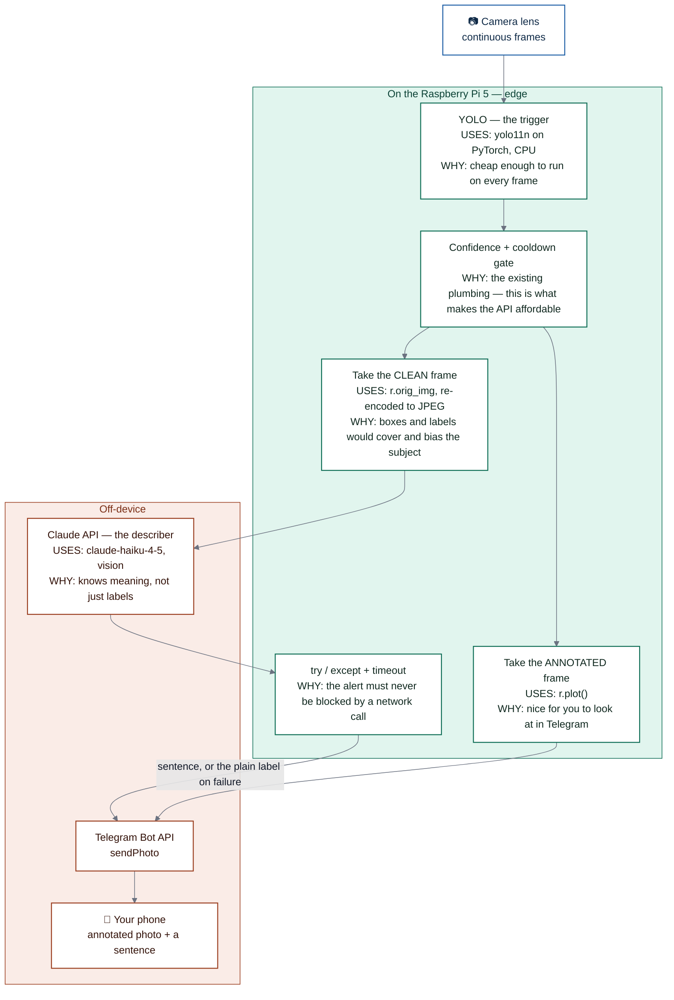

# 🗣️ Scene descriptions — plan

> **What this file is:** the implementation plan for [`IDEAS.md`](./IDEAS.md) item **#3** — replacing the bare label in a Telegram alert with a *sentence* written by a vision model. Written before the work starts, so the decisions are explicit; keep it accurate as the build happens, and it becomes the public writeup when the feature ships.
>
> Companion docs: [`DESIGN.md`](./DESIGN.md) (decisions already made) · [`BUILD-LOG.md`](./BUILD-LOG.md) (what's actually done) · [`README.md`](./README.md) (the public build guide).

---

## The goal, in one line

When an alert fires, send that single frame to a vision model and put the returned sentence in the Telegram caption.

**Today:**
> 👀 Detected: person

**After:**
> 👀 A man in a dark jacket is standing at the door holding a package.

YOLO does not change. It stays the **trigger**. The new piece is only the **describer**.

---

## Why this is the most interesting feature on the roadmap

It's an architecture that didn't exist a few years ago:

> **A small, fast, cheap model on the edge decides *when* something matters. A large model in the cloud decides *what it means*.**

YOLO is an excellent trigger and a hopeless describer — it can know "person," and it can never know "delivery." Splitting those two jobs by **cost**, **latency**, and **where the data lives** is the actual engineering idea, and it's the part worth writing up. The frame rate story in this project is about a hardware constraint; this one is about a *design* decision.



---

## The five decisions, made up front

| # | Decision | Choice | Why |
|---|---|---|---|
| 1 | **Which model** | `claude-haiku-4-5` | Vision-capable, cheapest current tier, fast (~0.7s to first token). One sentence about a webcam frame does not need frontier reasoning. Sonnet is the upgrade if descriptions feel thin. |
| 2 | **Which frame to send** | The **clean** frame (`r.orig_img`), *not* `r.plot()` | See below — this is the non-obvious one. |
| 3 | **Synchronous or threaded** | **Synchronous first**, thread it later | Blocking is readable and easy to debug; it costs ~1–2s of alert latency. Move the call into a thread once it works. |
| 4 | **Failure behaviour** | **Fail open** — `try/except` + ~10s timeout, fall back to the plain label | The single most important rule in the feature. |
| 5 | **Default state** | **Off.** A `--describe` flag + separate Telegram commands | Keeps the privacy-preserving mode the default. |

### On decision 2 — send the clean frame, not the annotated one

The detectors currently hold the **annotated** frame: `r.plot()`, with boxes and label text drawn on. It is tempting to just reuse it. Don't:

- The boxes **physically cover** the thing you're asking about — clothing, posture, what's in someone's hands.
- The printed label (`person 0.91`) **biases** the answer toward what YOLO already told you. You want an independent second opinion, not an echo of the first one.

So the frame splits two ways: **annotated → Telegram** (nice for you to look at), **clean → the API**. `detect_stream.py` already has JPEG bytes in memory, but they're the *annotated* ones, so it needs a second `cv2.imencode()` of `r.orig_img`.

---

## What it costs

| Item | Tokens | Notes |
|---|---|---|
| One 640×480 frame | ~400 | Image tokens ≈ (width × height) / 750 |
| The prompt | ~60 | Short and fixed |
| The reply | ~40 | One sentence, capped with `max_tokens` |

At Haiku 4.5's **$1 / $5 per million tokens** (input / output), that's roughly **$0.0007 per alert** — 50 alerts a day lands near a dollar a month.

**The reason it's this cheap is the plumbing that already exists.** The confidence threshold and per-object cooldown mean a handful of calls an hour, not one per frame — at 3.4 FPS an ungated version would be ~12,000 calls an hour. Worth pointing out in the writeup: infrastructure built for a different reason (not spamming your phone) is exactly what makes this affordable.

> Prices move. Check [Anthropic's pricing page](https://www.anthropic.com/pricing) before quoting numbers in the public README.

**Measured (first run, 2026-07-25):** a real 640×480 alert used **505 input + 28 output tokens = $0.00065/call**. Claude's one-sentence replies run shorter than the ~40-token estimate, so real cost lands near **$0.65 per 1,000 alerts** — slightly *under* the projection. See *Cost tracking in production* below for how this is logged and summed.

---

## The build steps

| # | Step | Why in this order |
|---|---|---|
| 1 | API key from [console.anthropic.com](https://console.anthropic.com) → add to `.env` → `sudo systemctl restart cv-detector` | The service already loads `.env` via `EnvironmentFile`, so no service-file change is needed. `.env` is gitignored — the key never touches git. |
| 2 | Write `describe.py` — one function, `describe(jpeg_bytes) -> str \| None` | One job, one file, testable in isolation |
| 3 | Test it standalone from the CLI on a saved `alert.jpg` | Same discipline as Step 6 of the README: prove it on a still image before touching the live loop |
| 4 | Tune the prompt, still on that one image | Prompt quality *is* most of the output quality, and iterating offline is free and instant |
| 5 | Wire into `detect_alert.py` behind `--describe` | The simplest detector — fewest moving parts |
| 6 | Wire into `detect_stream.py`, add Telegram commands, update the docs | The stream already has threading, so do it second |

### Dependencies

Use **`requests`**, which is already in `requirements.txt`. The official `anthropic` SDK is nicer on a large project, but for a single POST staying with raw HTTP means you actually see the request shape — an `image` block and a `text` block inside one `content` array — which is the thing worth understanding here.

### The shape of the call

Not the final code — just the anatomy, so the pieces are recognisable when we write it:

```python
# POST https://api.anthropic.com/v1/messages
# headers: x-api-key, anthropic-version, content-type
{
  "model": "claude-haiku-4-5",
  "max_tokens": 100,                     # a hard cap on cost and verbosity
  "messages": [{
    "role": "user",
    "content": [
      {"type": "image", "source": {
          "type": "base64",
          "media_type": "image/jpeg",
          "data": "<base64 of the CLEAN frame>"}},
      {"type": "text", "text": "<the prompt>"}
    ]
  }]
}
```

The reply comes back as a list of content blocks; the sentence is the `text` of the first one.

### Prompt notes

- State the **context**: a still frame from a fixed security camera.
- Ask for **exactly one sentence**, no preamble, no markdown, no hedging.
- Ask for what a *notification* needs: who or what, what they appear to be doing, anything carried or unusual.
- Tell it to say so plainly if the frame is too dark or blurred to read — better than a confident invention.

---

## Two expectations to set

**It will not identify people.** Claude will say "a man in a dark jacket," never "that's your neighbour." That's deliberate, documented behaviour — not a limitation to engineer around.

**This is the first feature that sends imagery off the device.** The project's edge-AI privacy claim — *video never leaves the Pi* — genuinely weakens here. The honest move is to state that plainly in the README rather than quietly dropping the claim. What can be said in mitigation:

- It fires only on **already-filtered alerts**, never on the raw stream.
- It's **opt-in per mode** and off by default.
- It sends **single frames**, not video.

---

## What changes, file by file

| File | Change |
|---|---|
| `describe.py` | **New.** One function; base64-encodes a JPEG, posts it, returns one sentence or `None`. |
| `detect_alert.py` | `--describe` flag; on alert, encode `r.orig_img` and use the sentence as the caption, falling back to the label. |
| `detect_stream.py` | Same, plus a second `imencode` of the clean frame (the cached bytes are annotated). |
| `telegram_control.py` | New commands that launch the describe-enabled modes; update `HELP`. |
| `.env` | `ANTHROPIC_API_KEY=` (gitignored — never committed). |
| `requirements.txt` | No change. |
| `README.md` | New step for the feature + the honest privacy paragraph in "what I learned." |
| `DESIGN.md` | Record the five decisions above in the AI-stack and tradeoffs sections. |
| `IDEAS.md` | Delete item #3 once this ships. |
| `BUILD-LOG.md` | Log it as the active phase; note gotchas as they appear. |

---

## Progress checklist

- [x] API key created and added to `.env` (service restart happens when we wire in)
- [x] `describe.py` written
- [x] Standalone test passing on a saved still image (`alert.jpg` → one clean sentence)
- [x] Prompt tuned to a consistent one-sentence output (landed first try)
- [x] Failure path verified (bad key → 401 caught → `describe()` returns `None`)
- [x] Wired into `detect_alert.py` behind `--describe` (clean frame → API, label fallback)
- [ ] Wired into `detect_stream.py`
- [x] Telegram commands added (`/describe` → people alerts + AI description; HELP updated)
- [x] Moved to a background thread in `detect_alert.py` (latency fix — loop no longer stalls on the API call)
- [ ] Cost checked against the real usage dashboard after a few days
- [ ] `README.md` + `DESIGN.md` updated; item removed from `IDEAS.md`

---

## What actually happened — results & ops notes

*Captured 2026-07-25, after wiring `--describe` into `detect_alert.py` and adding the `/describe` Telegram command.*

### It works
- Standalone test on a saved still and the live `/describe` mode both return one clean sentence, no preamble. The prompt needed no tuning past the first draft.
- **Fail-open verified:** a bad key returns a 401, which `describe()` catches → returns `None` → the alert still arrives with the plain `👀 Detected: person` caption.
- First 15 live calls: **0 failures**.

### Where things live (and why)
- **`describe.py` lives at the project root**, next to the other `detect_*.py` files — *not* in this feature folder. The detectors do `from describe import describe`, and Python can't cleanly import across a folder with a space in its name. This doc (the plan) stays in `features/scene description/`.

### The three operational gotchas
1. **After adding `ANTHROPIC_API_KEY` to `.env`, restart the service:** `sudo systemctl restart cv-detector`. The already-running controller captured its environment at startup; without a restart it (and every `/describe` subprocess it spawns) has no key, so descriptions silently fall back to the plain label.
2. **Code changes to `describe.py` need a fresh `/describe`, not a restart.** The controller spawns `detect_alert.py` as a subprocess on each command, and that subprocess imports `describe.py` from disk at launch. Sending `/describe` again auto-stops the current run and picks up the new code — no service restart required.
3. **Standalone CLI testing needs the key in the shell:** `set -a; . ./.env; set +a` before `python describe.py alert.jpg`. The systemd service loads `.env` via `EnvironmentFile`; a bare terminal does not.

### Cost tracking in production
`describe.py` logs the real token counts the API reports on every call:
```
describe usage: in=505 out=28 cost=$0.00065
```
Sum your actual spend straight from the journal anytime:
```bash
journalctl -u cv-detector --no-pager | grep "describe usage" | \
  awk -F'cost=\\$' '{s+=$2; n++} END{printf "%d calls, total $%.4f\n", n, s}'
```
After a few days, cross-check that total against the [Console usage dashboard](https://console.anthropic.com) — the logged figure is per-token exact; the Console is the billing source of truth.

### Known nuance (not yet fixed)
- The alert loop calls `describe()` once **per label** seen in a frame. In `--people` mode that's always one call per alert. In full-detection mode, two new object types in the same frame = two API calls describing the same image. Harmless (the cooldown caps it), but the fix — describe once per frame and reuse the sentence — is worth doing if general-mode describe is ever used heavily.

---

## References

- **Claude API — vision / images** — [docs.claude.com/en/docs/build-with-claude/vision](https://docs.claude.com/en/docs/build-with-claude/vision)
- **Messages API** — [docs.claude.com/en/api/overview](https://docs.claude.com/en/api/overview)
- **Model list & pricing** — [anthropic.com/pricing](https://www.anthropic.com/pricing)
- **Console (API keys, usage dashboard)** — [console.anthropic.com](https://console.anthropic.com)
